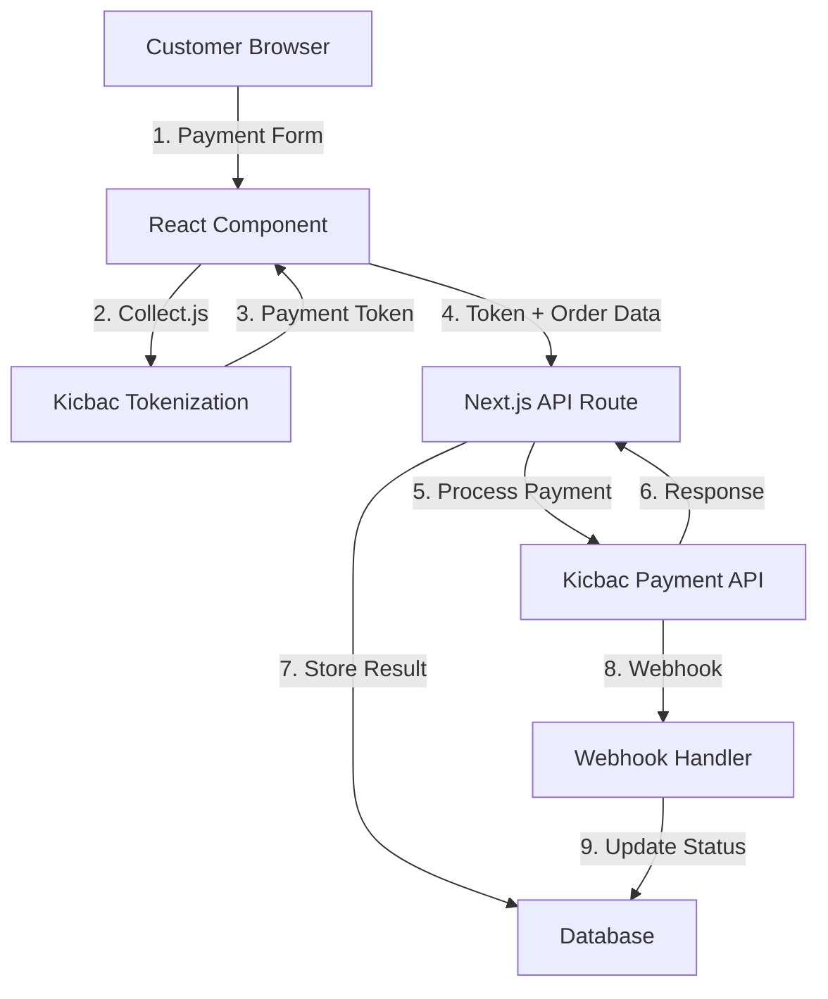

# Kicbac Payment Processing Implementation Guide

## Table of Contents

1. [Overview](#overview)
2. [Required API Keys & Credentials](#required-api-keys--credentials)
3. [Architecture Overview](#architecture-overview)
4. [Implementation Steps](#implementation-steps)
5. [Collect.js Integration](#collectjs-integration)
6. [Payment API Integration](#payment-api-integration)
7. [Customer Vault](#customer-vault)
8. [Recurring Payments & Subscriptions](#recurring-payments--subscriptions)
9. [Webhook Integration](#webhook-integration)
10. [Query API](#query-api)
11. [Testing](#testing)
12. [Security & PCI Compliance](#security--pci-compliance)
13. [Error Handling](#error-handling)
14. [Production Checklist](#production-checklist)

## Overview

Kicbac is a comprehensive payment processing platform that provides secure payment tokenization, transaction processing, recurring billing, and real-time webhook notifications. This guide covers the complete implementation for a SaaS platform using React, Next.js, TypeScript, and Tailwind CSS.

### Key Components

1. **Collect.js** - Client-side tokenization library for PCI compliance (SAQ-A)
2. **Payment API** - Server-side transaction processing
3. **Customer Vault** - Secure storage of payment credentials
4. **Recurring Module** - Subscription and recurring payment management
5. **Webhooks** - Real-time payment event notifications
6. **Query API** - Transaction reporting and data retrieval

### Documentation References

- **Collect.js**: `/Kicbac_API_Docs/Kicbac-Collect-JS.pdf` - Client-side tokenization
- **Payment API**: `/Kicbac_API_Docs/Kicbac-Direct-Post-API.pdf` - Transaction processing
- **Query API**: `/Kicbac_API_Docs/Kicbac-Query-API.pdf` - Reporting and queries
- **Webhooks**: `/Kicbac_API_Docs/Webhooks/` - Event notifications

## Required API Keys & Credentials

### Essential Credentials

```typescript
interface KicbacCredentials {
  // Primary API Credentials
  security_key: string;        // API Security Key (from Settings > Security Keys)
  
  // Optional but Recommended
  webhook_url: string;          // Your webhook endpoint URL
  webhook_security_key: string; // For webhook signature validation
  
  // Environment
  api_url: string;              // https://kicbac.transactiongateway.com/api/transact.php
  query_url: string;            // https://kicbac.transactiongateway.com/api/query.php
  collectjs_url: string;        // https://secure.nmi.com/token/Collect.js
}
```

### Obtaining API Keys

1. Log into your Kicbac merchant control panel
2. Navigate to **Settings > Security Keys**
3. Generate a new API Security Key
4. Store securely in environment variables:

```env
# .env.local
KICBAC_SECURITY_KEY=your_security_key_here
KICBAC_API_URL=https://kicbac.transactiongateway.com/api/transact.php
KICBAC_QUERY_URL=https://kicbac.transactiongateway.com/api/query.php
KICBAC_WEBHOOK_URL=https://yourdomain.com/api/webhooks/kicbac
NEXT_PUBLIC_KICBAC_TOKENIZATION_KEY=your_public_tokenization_key
```

## Architecture Overview



## Implementation Steps

### Step 1: Project Setup

```bash
# Install required packages
npm install axios crypto uuid
npm install --save-dev @types/crypto-js
```

### Step 2: Environment Configuration

Create environment variable management:

```typescript
// src/config/kicbac.config.ts
export const kicbacConfig = {
  securityKey: process.env.KICBAC_SECURITY_KEY!,
  apiUrl: process.env.KICBAC_API_URL!,
  queryUrl: process.env.KICBAC_QUERY_URL!,
  webhookUrl: process.env.KICBAC_WEBHOOK_URL!,
  tokenizationKey: process.env.NEXT_PUBLIC_KICBAC_TOKENIZATION_KEY!,
  environment: process.env.NODE_ENV === 'production' ? 'production' : 'test'
};
```

## Collect.js Integration

### Implementation Methods

Kicbac offers two integration methods for Collect.js:

1. **Lightbox Integration** - Popup modal for payment form
2. **Inline Integration** - Embedded payment fields

### Lightbox Integration (Recommended for Quick Setup)

```tsx
// src/components/PaymentForm.tsx
import React, { useEffect, useState } from 'react';
import Script from 'next/script';

interface PaymentFormProps {
  amount: number;
  onSuccess: (token: string) => void;
  onError: (error: string) => void;
}

declare global {
  interface Window {
    CollectJS: {
      configure: (config: any) => void;
      startPaymentRequest: () => void;
    };
  }
}

export const PaymentFormLightbox: React.FC<PaymentFormProps> = ({
  amount,
  onSuccess,
  onError
}) => {
  const [isScriptLoaded, setIsScriptLoaded] = useState(false);

  useEffect(() => {
    if (isScriptLoaded && window.CollectJS) {
      window.CollectJS.configure({
        paymentSelector: '#payButton',
        variant: 'lightbox',
        country: 'US',
        price: amount.toFixed(2),
        currency: 'USD',
        validationCallback: (field: string, status: boolean, message: string) => {
          console.log(`Field: ${field}, Valid: ${status}, Message: ${message}`);
        },
        fieldsAvailableCallback: () => {
          console.log('Payment fields are ready');
        },
        callback: (response: any) => {
          if (response.token) {
            onSuccess(response.token);
          } else {
            onError(response.message || 'Payment failed');
          }
        }
      });
    }
  }, [isScriptLoaded, amount, onSuccess, onError]);

  return (
    <>
      <Script
        src="https://secure.nmi.com/token/Collect.js"
        data-tokenization-key={process.env.NEXT_PUBLIC_KICBAC_TOKENIZATION_KEY}
        onLoad={() => setIsScriptLoaded(true)}
      />
      <button
        id="payButton"
        className="bg-blue-600 text-white px-6 py-3 rounded-lg hover:bg-blue-700 transition"
        type="button"
      >
        Pay ${amount.toFixed(2)}
      </button>
    </>
  );
};
```

### Inline Integration (Recommended for Custom UI)

```tsx
// src/components/PaymentFormInline.tsx
import React, { useEffect, useState } from 'react';
import Script from 'next/script';

interface PaymentFormInlineProps {
  amount: number;
  onSuccess: (token: string) => void;
  onError: (error: string) => void;
}

export const PaymentFormInline: React.FC<PaymentFormInlineProps> = ({
  amount,
  onSuccess,
  onError
}) => {
  const [isScriptLoaded, setIsScriptLoaded] = useState(false);
  const [isValid, setIsValid] = useState(false);
  const [fieldStatus, setFieldStatus] = useState({
    ccnumber: false,
    ccexp: false,
    cvv: false
  });

  useEffect(() => {
    if (isScriptLoaded && window.CollectJS) {
      window.CollectJS.configure({
        variant: 'inline',
        country: 'US',
        fields: {
          ccnumber: {
            selector: '#ccnumber',
            placeholder: '•••• •••• •••• ••••',
            title: 'Card Number'
          },
          ccexp: {
            selector: '#ccexp',
            placeholder: 'MM / YY',
            title: 'Card Expiration'
          },
          cvv: {
            selector: '#cvv',
            placeholder: 'CVV',
            title: 'CVV Code'
          }
        },
        styleSniffer: true,
        validationCallback: (field: string, status: boolean, message: string) => {
          setFieldStatus(prev => ({
            ...prev,
            [field]: status
          }));
          
          // Check if all fields are valid
          const allValid = Object.values({
            ...fieldStatus,
            [field]: status
          }).every(s => s === true);
          setIsValid(allValid);
        },
        fieldsAvailableCallback: () => {
          console.log('Inline payment fields are ready');
        },
        callback: (response: any) => {
          if (response.token) {
            onSuccess(response.token);
          } else {
            onError(response.message || 'Tokenization failed');
          }
        }
      });
    }
  }, [isScriptLoaded, onSuccess, onError]);

  const handleSubmit = (e: React.FormEvent) => {
    e.preventDefault();
    if (isValid && window.CollectJS) {
      window.CollectJS.startPaymentRequest();
    }
  };

  return (
    <>
      <Script
        src="https://secure.nmi.com/token/Collect.js"
        data-tokenization-key={process.env.NEXT_PUBLIC_KICBAC_TOKENIZATION_KEY}
        onLoad={() => setIsScriptLoaded(true)}
      />
      
      <form onSubmit={handleSubmit} className="space-y-4 max-w-md mx-auto p-6 bg-white rounded-lg shadow">
        <h3 className="text-xl font-semibold mb-4">Payment Information</h3>
        
        <div className="space-y-4">
          <div>
            <label className="block text-sm font-medium text-gray-700 mb-1">
              Card Number
            </label>
            <div 
              id="ccnumber"
              className="border rounded-md px-3 py-2 focus:outline-none focus:ring-2 focus:ring-blue-500"
            />
          </div>
          
          <div className="grid grid-cols-2 gap-4">
            <div>
              <label className="block text-sm font-medium text-gray-700 mb-1">
                Expiration
              </label>
              <div 
                id="ccexp"
                className="border rounded-md px-3 py-2 focus:outline-none focus:ring-2 focus:ring-blue-500"
              />
            </div>
            
            <div>
              <label className="block text-sm font-medium text-gray-700 mb-1">
                CVV
              </label>
              <div 
                id="cvv"
                className="border rounded-md px-3 py-2 focus:outline-none focus:ring-2 focus:ring-blue-500"
              />
            </div>
          </div>
        </div>
        
        <button
          type="submit"
          disabled={!isValid}
          className={`w-full py-3 px-4 rounded-md font-medium transition ${
            isValid
              ? 'bg-blue-600 text-white hover:bg-blue-700'
              : 'bg-gray-300 text-gray-500 cursor-not-allowed'
          }`}
        >
          Pay ${amount.toFixed(2)}
        </button>
      </form>
    </>
  );
};
```

## Payment API Integration

### API Client Service

```typescript
// src/services/kicbac.service.ts
import axios from 'axios';
import { kicbacConfig } from '@/config/kicbac.config';

interface TransactionRequest {
  type: 'sale' | 'auth' | 'capture' | 'void' | 'refund' | 'credit';
  amount?: number;
  payment_token?: string;
  customer_vault_id?: string;
  order_id?: string;
  order_description?: string;
  customer_receipt?: boolean;
  billing?: {
    first_name?: string;
    last_name?: string;
    company?: string;
    address1?: string;
    city?: string;
    state?: string;
    zip?: string;
    country?: string;
    email?: string;
    phone?: string;
  };
  shipping?: {
    first_name?: string;
    last_name?: string;
    address1?: string;
    city?: string;
    state?: string;
    zip?: string;
    country?: string;
  };
}

interface TransactionResponse {
  response: string;
  responsetext: string;
  response_code: string;
  transactionid: string;
  authcode?: string;
  customer_vault_id?: string;
  type: string;
  amount?: string;
}

export class KicbacService {
  private apiUrl = kicbacConfig.apiUrl;
  private securityKey = kicbacConfig.securityKey;

  /**
   * Process a payment transaction
   */
  async processTransaction(request: TransactionRequest): Promise<TransactionResponse> {
    const payload = new URLSearchParams({
      security_key: this.securityKey,
      ...this.flattenObject(request)
    });

    try {
      const response = await axios.post(this.apiUrl, payload.toString(), {
        headers: {
          'Content-Type': 'application/x-www-form-urlencoded'
        }
      });

      return this.parseResponse(response.data);
    } catch (error) {
      console.error('Transaction failed:', error);
      throw error;
    }
  }

  /**
   * Create or update a customer in the vault
   */
  async createCustomerVault(
    customerId: string,
    paymentToken: string,
    billing?: any
  ): Promise<TransactionResponse> {
    return this.processTransaction({
      type: 'sale',
      amount: 0, // $0 auth to validate card
      payment_token: paymentToken,
      customer_vault_id: customerId,
      billing,
      customer_vault: 'add_customer'
    } as any);
  }

  /**
   * Charge a stored customer
   */
  async chargeCustomer(
    customerId: string,
    amount: number,
    orderId?: string
  ): Promise<TransactionResponse> {
    return this.processTransaction({
      type: 'sale',
      amount,
      customer_vault_id: customerId,
      order_id: orderId
    });
  }

  /**
   * Refund a transaction
   */
  async refundTransaction(
    transactionId: string,
    amount?: number
  ): Promise<TransactionResponse> {
    return this.processTransaction({
      type: 'refund',
      transactionid: transactionId,
      amount
    } as any);
  }

  /**
   * Helper to flatten nested objects for URL encoding
   */
  private flattenObject(obj: any, prefix = ''): Record<string, string> {
    const flattened: Record<string, string> = {};
    
    for (const key in obj) {
      if (obj[key] === undefined || obj[key] === null) continue;
      
      const newKey = prefix ? `${prefix}[${key}]` : key;
      
      if (typeof obj[key] === 'object' && !Array.isArray(obj[key])) {
        Object.assign(flattened, this.flattenObject(obj[key], newKey));
      } else {
        flattened[newKey] = String(obj[key]);
      }
    }
    
    return flattened;
  }

  /**
   * Parse response string to object
   */
  private parseResponse(responseString: string): TransactionResponse {
    const params = new URLSearchParams(responseString);
    const response: any = {};
    
    params.forEach((value, key) => {
      response[key] = value;
    });
    
    return response;
  }
}
```

### API Route Handler

```typescript
// src/app/api/payments/process/route.ts
import { NextRequest, NextResponse } from 'next/server';
import { KicbacService } from '@/services/kicbac.service';
import { z } from 'zod';

const PaymentSchema = z.object({
  token: z.string(),
  amount: z.number().positive(),
  customerId: z.string().optional(),
  saveCard: z.boolean().optional(),
  billing: z.object({
    firstName: z.string(),
    lastName: z.string(),
    email: z.string().email(),
    address: z.string(),
    city: z.string(),
    state: z.string(),
    zip: z.string(),
    country: z.string().default('US')
  })
});

export async function POST(request: NextRequest) {
  try {
    const body = await request.json();
    const validated = PaymentSchema.parse(body);
    
    const kicbac = new KicbacService();
    
    // Process the payment
    const result = await kicbac.processTransaction({
      type: 'sale',
      amount: validated.amount,
      payment_token: validated.token,
      customer_vault_id: validated.saveCard ? validated.customerId : undefined,
      billing: {
        first_name: validated.billing.firstName,
        last_name: validated.billing.lastName,
        email: validated.billing.email,
        address1: validated.billing.address,
        city: validated.billing.city,
        state: validated.billing.state,
        zip: validated.billing.zip,
        country: validated.billing.country
      }
    });
    
    // Check response
    if (result.response === '1') {
      // Success
      return NextResponse.json({
        success: true,
        transactionId: result.transactionid,
        authCode: result.authcode,
        message: result.responsetext
      });
    } else {
      // Failed
      return NextResponse.json({
        success: false,
        message: result.responsetext,
        code: result.response_code
      }, { status: 400 });
    }
  } catch (error) {
    console.error('Payment processing error:', error);
    return NextResponse.json({
      success: false,
      message: 'Payment processing failed'
    }, { status: 500 });
  }
}
```

## Customer Vault

The Customer Vault securely stores payment credentials for recurring billing and one-click checkout.

### Vault Operations

```typescript
// src/services/customer-vault.service.ts
import { KicbacService } from './kicbac.service';

export class CustomerVaultService extends KicbacService {
  /**
   * Add a new customer to the vault
   */
  async addCustomer(
    customerId: string,
    paymentToken: string,
    customerInfo: {
      firstName: string;
      lastName: string;
      email: string;
      phone?: string;
    }
  ) {
    return this.processTransaction({
      type: 'sale',
      amount: 0, // $0.00 auth to validate
      payment_token: paymentToken,
      customer_vault: 'add_customer',
      customer_vault_id: customerId,
      billing: {
        first_name: customerInfo.firstName,
        last_name: customerInfo.lastName,
        email: customerInfo.email,
        phone: customerInfo.phone
      }
    } as any);
  }

  /**
   * Update customer payment method
   */
  async updateCustomer(
    customerId: string,
    paymentToken: string
  ) {
    return this.processTransaction({
      type: 'sale',
      amount: 0,
      payment_token: paymentToken,
      customer_vault: 'update_customer',
      customer_vault_id: customerId
    } as any);
  }

  /**
   * Delete customer from vault
   */
  async deleteCustomer(customerId: string) {
    return this.processTransaction({
      customer_vault: 'delete_customer',
      customer_vault_id: customerId
    } as any);
  }

  /**
   * Retrieve customer information
   */
  async getCustomer(customerId: string) {
    const queryUrl = kicbacConfig.queryUrl;
    const params = new URLSearchParams({
      security_key: this.securityKey,
      report_type: 'customer_vault',
      customer_vault_id: customerId
    });

    const response = await fetch(queryUrl, {
      method: 'POST',
      headers: {
        'Content-Type': 'application/x-www-form-urlencoded'
      },
      body: params.toString()
    });

    return response.text();
  }
}
```

## Recurring Payments & Subscriptions

### Subscription Plan Management

```typescript
// src/services/subscription.service.ts
interface SubscriptionPlan {
  plan_id: string;
  plan_name: string;
  plan_amount: number;
  plan_payments?: number; // 0 for unlimited
  month_frequency?: number;
  day_of_month?: number;
}

interface Subscription {
  recurring: 'add_subscription';
  customer_vault_id: string;
  plan_id: string;
  start_date?: string; // YYYYMMDD
}

export class SubscriptionService extends KicbacService {
  /**
   * Create a recurring plan
   */
  async createPlan(plan: SubscriptionPlan) {
    return this.processTransaction({
      recurring: 'add_plan',
      ...plan
    } as any);
  }

  /**
   * Subscribe customer to a plan
   */
  async subscribeCustomer(
    customerId: string,
    planId: string,
    startDate?: Date
  ) {
    const formattedDate = startDate 
      ? this.formatDate(startDate)
      : this.formatDate(new Date());
    
    return this.processTransaction({
      recurring: 'add_subscription',
      customer_vault_id: customerId,
      plan_id: planId,
      start_date: formattedDate
    } as any);
  }

  /**
   * Update subscription
   */
  async updateSubscription(
    subscriptionId: string,
    updates: {
      planId?: string;
      paused?: boolean;
    }
  ) {
    return this.processTransaction({
      recurring: 'update_subscription',
      subscription_id: subscriptionId,
      plan_id: updates.planId,
      paused: updates.paused ? '1' : '0'
    } as any);
  }

  /**
   * Cancel subscription
   */
  async cancelSubscription(subscriptionId: string) {
    return this.processTransaction({
      recurring: 'delete_subscription',
      subscription_id: subscriptionId
    } as any);
  }

  /**
   * Format date as YYYYMMDD
   */
  private formatDate(date: Date): string {
    const year = date.getFullYear();
    const month = String(date.getMonth() + 1).padStart(2, '0');
    const day = String(date.getDate()).padStart(2, '0');
    return `${year}${month}${day}`;
  }
}
```

### Complete Subscription Implementation

```tsx
// src/components/SubscriptionManager.tsx
import React, { useState } from 'react';
import { PaymentFormInline } from './PaymentFormInline';
import { toast } from 'react-hot-toast';

interface Plan {
  id: string;
  name: string;
  price: number;
  interval: 'monthly' | 'yearly';
  features: string[];
}

const plans: Plan[] = [
  {
    id: 'basic_monthly',
    name: 'Basic',
    price: 9.99,
    interval: 'monthly',
    features: ['Feature 1', 'Feature 2', 'Feature 3']
  },
  {
    id: 'pro_monthly',
    name: 'Professional',
    price: 29.99,
    interval: 'monthly',
    features: ['All Basic features', 'Feature 4', 'Feature 5', 'Priority Support']
  },
  {
    id: 'enterprise_monthly',
    name: 'Enterprise',
    price: 99.99,
    interval: 'monthly',
    features: ['All Pro features', 'Feature 6', 'Feature 7', 'Dedicated Support']
  }
];

export const SubscriptionManager: React.FC = () => {
  const [selectedPlan, setSelectedPlan] = useState<Plan | null>(null);
  const [isProcessing, setIsProcessing] = useState(false);

  const handlePaymentToken = async (token: string) => {
    if (!selectedPlan) return;
    
    setIsProcessing(true);
    
    try {
      // Step 1: Create customer in vault with payment token
      const vaultResponse = await fetch('/api/customer-vault/create', {
        method: 'POST',
        headers: { 'Content-Type': 'application/json' },
        body: JSON.stringify({
          paymentToken: token,
          email: 'customer@example.com', // Get from user session
          firstName: 'John',
          lastName: 'Doe'
        })
      });
      
      const vaultData = await vaultResponse.json();
      
      if (!vaultData.success) {
        throw new Error(vaultData.message);
      }
      
      // Step 2: Subscribe customer to plan
      const subscriptionResponse = await fetch('/api/subscriptions/create', {
        method: 'POST',
        headers: { 'Content-Type': 'application/json' },
        body: JSON.stringify({
          customerId: vaultData.customerId,
          planId: selectedPlan.id
        })
      });
      
      const subscriptionData = await subscriptionResponse.json();
      
      if (subscriptionData.success) {
        toast.success('Subscription activated successfully!');
        // Redirect to dashboard or update UI
      } else {
        throw new Error(subscriptionData.message);
      }
    } catch (error) {
      toast.error('Subscription failed. Please try again.');
      console.error('Subscription error:', error);
    } finally {
      setIsProcessing(false);
    }
  };

  return (
    <div className="max-w-6xl mx-auto p-6">
      <h2 className="text-3xl font-bold text-center mb-8">Choose Your Plan</h2>
      
      {/* Plan Selection */}
      <div className="grid md:grid-cols-3 gap-6 mb-8">
        {plans.map(plan => (
          <div
            key={plan.id}
            className={`border-2 rounded-lg p-6 cursor-pointer transition ${
              selectedPlan?.id === plan.id
                ? 'border-blue-500 bg-blue-50'
                : 'border-gray-200 hover:border-gray-300'
            }`}
            onClick={() => setSelectedPlan(plan)}
          >
            <h3 className="text-xl font-semibold mb-2">{plan.name}</h3>
            <div className="text-3xl font-bold mb-4">
              ${plan.price}
              <span className="text-sm text-gray-600">/{plan.interval}</span>
            </div>
            <ul className="space-y-2">
              {plan.features.map((feature, i) => (
                <li key={i} className="flex items-center">
                  <svg className="w-5 h-5 text-green-500 mr-2" fill="currentColor" viewBox="0 0 20 20">
                    <path fillRule="evenodd" d="M16.707 5.293a1 1 0 010 1.414l-8 8a1 1 0 01-1.414 0l-4-4a1 1 0 011.414-1.414L8 12.586l7.293-7.293a1 1 0 011.414 0z" clipRule="evenodd" />
                  </svg>
                  {feature}
                </li>
              ))}
            </ul>
          </div>
        ))}
      </div>
      
      {/* Payment Form */}
      {selectedPlan && (
        <div className="bg-gray-50 rounded-lg p-6">
          <h3 className="text-xl font-semibold mb-4">
            Complete Your Subscription
          </h3>
          <PaymentFormInline
            amount={selectedPlan.price}
            onSuccess={handlePaymentToken}
            onError={(error) => toast.error(error)}
          />
        </div>
      )}
    </div>
  );
};
```

## Webhook Integration

### Webhook Handler

```typescript
// src/app/api/webhooks/kicbac/route.ts
import { NextRequest, NextResponse } from 'next/server';
import crypto from 'crypto';

interface WebhookEvent {
  event_type: string;
  event_body: {
    transaction_id?: string;
    subscription_id?: string;
    customer_vault_id?: string;
    action?: string;
    amount?: string;
    response_text?: string;
    response_code?: string;
    [key: string]: any;
  };
}

// Webhook event handlers
const eventHandlers = {
  'transaction.sale.success': async (event: WebhookEvent) => {
    const { transaction_id, amount, customer_vault_id } = event.event_body;
    console.log(`Sale successful: Transaction ${transaction_id}, Amount: ${amount}`);
    // Update database, send confirmation email, etc.
  },
  
  'transaction.sale.failure': async (event: WebhookEvent) => {
    const { transaction_id, response_text } = event.event_body;
    console.log(`Sale failed: Transaction ${transaction_id}, Reason: ${response_text}`);
    // Log failure, notify customer, etc.
  },
  
  'recurring.subscription.add': async (event: WebhookEvent) => {
    const { subscription_id, customer_vault_id } = event.event_body;
    console.log(`New subscription: ${subscription_id} for customer ${customer_vault_id}`);
    // Activate subscription in database
  },
  
  'recurring.subscription.update': async (event: WebhookEvent) => {
    const { subscription_id, action } = event.event_body;
    console.log(`Subscription updated: ${subscription_id}, Action: ${action}`);
    // Update subscription status
  },
  
  'recurring.subscription.delete': async (event: WebhookEvent) => {
    const { subscription_id } = event.event_body;
    console.log(`Subscription cancelled: ${subscription_id}`);
    // Deactivate subscription, schedule access removal
  },
  
  'settlement.batch.complete': async (event: WebhookEvent) => {
    const { batch_id, transaction_count, total_amount } = event.event_body;
    console.log(`Settlement complete: Batch ${batch_id}, ${transaction_count} transactions, Total: ${total_amount}`);
    // Update settlement records
  },
  
  'chargeback.batch.complete': async (event: WebhookEvent) => {
    const { transaction_id, amount } = event.event_body;
    console.log(`Chargeback received: Transaction ${transaction_id}, Amount: ${amount}`);
    // Handle chargeback, flag account, notify team
  }
};

export async function POST(request: NextRequest) {
  try {
    const body = await request.text();
    
    // Verify webhook signature if configured
    const signature = request.headers.get('X-Webhook-Signature');
    if (signature && process.env.KICBAC_WEBHOOK_SECRET) {
      const expectedSignature = crypto
        .createHmac('sha256', process.env.KICBAC_WEBHOOK_SECRET)
        .update(body)
        .digest('hex');
      
      if (signature !== expectedSignature) {
        console.error('Invalid webhook signature');
        return NextResponse.json({ error: 'Invalid signature' }, { status: 401 });
      }
    }
    
    // Parse webhook event
    const event: WebhookEvent = JSON.parse(body);
    console.log(`Webhook received: ${event.event_type}`);
    
    // Handle event
    const handler = eventHandlers[event.event_type as keyof typeof eventHandlers];
    if (handler) {
      await handler(event);
    } else {
      console.log(`Unhandled webhook event: ${event.event_type}`);
    }
    
    // Always respond with 200 to acknowledge receipt
    return NextResponse.json({ received: true });
    
  } catch (error) {
    console.error('Webhook processing error:', error);
    // Still return 200 to prevent retries for malformed requests
    return NextResponse.json({ error: 'Processing failed' }, { status: 200 });
  }
}
```

### Webhook Retry Logic

Kicbac implements automatic retry logic for failed webhook deliveries:

```typescript
// Webhook retry schedule (from Webhooks/retryLogic.txt)
const retrySchedule = [
  { attempt: 1, delay: 'immediate' },
  { attempt: 2, delay: '5 minutes' },
  { attempt: 3, delay: '15 minutes' },
  { attempt: 4, delay: '30 minutes' },
  { attempt: 5, delay: '1 hour' },
  { attempt: 6, delay: '2 hours' },
  { attempt: 7, delay: '4 hours' },
  { attempt: 8, delay: '8 hours' },
  { attempt: 9, delay: '16 hours' },
  { attempt: 10, delay: '24 hours' }
];
```

### Webhook Event Types

Complete list of webhook events:

```typescript
enum WebhookEventTypes {
  // Transaction Events
  TRANSACTION_SALE_SUCCESS = 'transaction.sale.success',
  TRANSACTION_SALE_FAILURE = 'transaction.sale.failure',
  TRANSACTION_AUTH_SUCCESS = 'transaction.auth.success',
  TRANSACTION_CAPTURE_SUCCESS = 'transaction.capture.success',
  TRANSACTION_VOID_SUCCESS = 'transaction.void.success',
  TRANSACTION_REFUND_SUCCESS = 'transaction.refund.success',
  
  // Recurring Events
  RECURRING_PLAN_ADD = 'recurring.plan.add',
  RECURRING_PLAN_UPDATE = 'recurring.plan.update',
  RECURRING_PLAN_DELETE = 'recurring.plan.delete',
  RECURRING_SUBSCRIPTION_ADD = 'recurring.subscription.add',
  RECURRING_SUBSCRIPTION_UPDATE = 'recurring.subscription.update',
  RECURRING_SUBSCRIPTION_DELETE = 'recurring.subscription.delete',
  RECURRING_PAYMENT_SUCCESS = 'recurring.payment.success',
  RECURRING_PAYMENT_FAILURE = 'recurring.payment.failure',
  
  // Settlement Events
  SETTLEMENT_BATCH_COMPLETE = 'settlement.batch.complete',
  SETTLEMENT_BATCH_FAILURE = 'settlement.batch.failure',
  
  // Chargeback Events
  CHARGEBACK_BATCH_COMPLETE = 'chargeback.batch.complete',
  
  // ACH/Check Events
  CHECK_STATUS_SETTLE = 'transaction.check.status.settle',
  CHECK_STATUS_RETURN = 'transaction.check.status.return',
  CHECK_STATUS_LATERETURN = 'transaction.check.status.latereturn',
  
  // Card Updater Events
  ACU_SUMMARY_UPDATED = 'acu.summary.automaticallyupdated',
  ACU_SUMMARY_CLOSED = 'acu.summary.closedaccount',
  ACU_SUMMARY_CONTACT = 'acu.summary.contactcustomer'
}
```

## Query API

### Transaction Query Service

```typescript
// src/services/query.service.ts
import { kicbacConfig } from '@/config/kicbac.config';

interface QueryParams {
  condition?: string[];
  transaction_type?: 'cc' | 'ck';
  action_type?: string[];
  source?: string[];
  transaction_id?: string;
  subscription_id?: string;
  start_date?: string; // YYYYMMDDhhmmss
  end_date?: string;
  result_limit?: number;
  page_number?: number;
  report_type?: 'transaction' | 'customer_vault' | 'recurring' | 'invoicing';
}

export class QueryService {
  private queryUrl = kicbacConfig.queryUrl;
  private securityKey = kicbacConfig.securityKey;

  /**
   * Query transactions
   */
  async queryTransactions(params: QueryParams) {
    const queryParams = new URLSearchParams({
      security_key: this.securityKey,
      ...this.formatParams(params)
    });

    const response = await fetch(this.queryUrl, {
      method: 'POST',
      headers: {
        'Content-Type': 'application/x-www-form-urlencoded'
      },
      body: queryParams.toString()
    });

    const xml = await response.text();
    return this.parseXmlResponse(xml);
  }

  /**
   * Get transaction by ID
   */
  async getTransaction(transactionId: string) {
    return this.queryTransactions({
      transaction_id: transactionId
    });
  }

  /**
   * Get customer subscriptions
   */
  async getCustomerSubscriptions(customerId: string) {
    return this.queryTransactions({
      report_type: 'recurring',
      customer_vault_id: customerId
    } as any);
  }

  /**
   * Get settlement report
   */
  async getSettlementReport(startDate: Date, endDate: Date) {
    return this.queryTransactions({
      condition: ['complete'],
      start_date: this.formatDateTime(startDate),
      end_date: this.formatDateTime(endDate)
    });
  }

  private formatParams(params: QueryParams): Record<string, string> {
    const formatted: Record<string, string> = {};
    
    for (const [key, value] of Object.entries(params)) {
      if (value === undefined) continue;
      
      if (Array.isArray(value)) {
        formatted[key] = value.join(',');
      } else {
        formatted[key] = String(value);
      }
    }
    
    return formatted;
  }

  private formatDateTime(date: Date): string {
    const year = date.getFullYear();
    const month = String(date.getMonth() + 1).padStart(2, '0');
    const day = String(date.getDate()).padStart(2, '0');
    const hours = String(date.getHours()).padStart(2, '0');
    const minutes = String(date.getMinutes()).padStart(2, '0');
    const seconds = String(date.getSeconds()).padStart(2, '0');
    
    return `${year}${month}${day}${hours}${minutes}${seconds}`;
  }

  private parseXmlResponse(xml: string): any {
    // Simple XML parser - in production use a proper XML library
    const transactions: any[] = [];
    const transactionRegex = /<transaction>(.*?)<\/transaction>/gs;
    let match;
    
    while ((match = transactionRegex.exec(xml)) !== null) {
      const transaction: any = {};
      const fieldRegex = /<(\w+)>(.*?)<\/\1>/g;
      let fieldMatch;
      
      while ((fieldMatch = fieldRegex.exec(match[1])) !== null) {
        transaction[fieldMatch[1]] = fieldMatch[2];
      }
      
      transactions.push(transaction);
    }
    
    return transactions;
  }
}
```

## Testing

### Test Mode Configuration

```typescript
// src/config/test.config.ts
export const testConfig = {
  // Test credit card numbers
  testCards: {
    visa: {
      number: '4111111111111111',
      cvv: '999',
      exp: '1225'
    },
    mastercard: {
      number: '5431111111111111',
      cvv: '999',
      exp: '1225'
    },
    amex: {
      number: '341111111111111',
      cvv: '9997',
      exp: '1225'
    },
    discover: {
      number: '6011601160116611',
      cvv: '999',
      exp: '1225'
    }
  },
  
  // Test response triggers
  responseAmounts: {
    approved: 1.00,
    declined: 0.05,
    avs_failure: 0.06,
    cvv_failure: 0.07,
    partial_approval: 0.15
  },
  
  // Test environment detection
  isTestMode: process.env.NODE_ENV !== 'production'
};
```

### Integration Tests

```typescript
// __tests__/payment.test.ts
import { KicbacService } from '@/services/kicbac.service';
import { testConfig } from '@/config/test.config';

describe('Kicbac Payment Processing', () => {
  let kicbac: KicbacService;
  
  beforeAll(() => {
    kicbac = new KicbacService();
  });
  
  test('Should process successful payment', async () => {
    const result = await kicbac.processTransaction({
      type: 'sale',
      amount: testConfig.responseAmounts.approved,
      payment_token: 'test_token_here',
      billing: {
        first_name: 'Test',
        last_name: 'User',
        email: 'test@example.com'
      }
    });
    
    expect(result.response).toBe('1');
    expect(result.responsetext).toContain('APPROVED');
  });
  
  test('Should handle declined payment', async () => {
    const result = await kicbac.processTransaction({
      type: 'sale',
      amount: testConfig.responseAmounts.declined,
      payment_token: 'test_token_here'
    });
    
    expect(result.response).toBe('2');
    expect(result.responsetext).toContain('DECLINED');
  });
  
  test('Should create customer vault', async () => {
    const result = await kicbac.createCustomerVault(
      'test_customer_123',
      'test_token_here',
      {
        first_name: 'Test',
        last_name: 'Customer',
        email: 'customer@example.com'
      }
    );
    
    expect(result.response).toBe('1');
    expect(result.customer_vault_id).toBe('test_customer_123');
  });
});
```

## Security & PCI Compliance

### Security Best Practices

1. **Never store card data** - Always use Collect.js tokenization
2. **Secure API keys** - Store in environment variables, never in code
3. **HTTPS only** - All payment communications must use SSL/TLS
4. **Webhook validation** - Always verify webhook signatures
5. **Rate limiting** - Implement rate limiting on payment endpoints
6. **Fraud detection** - Monitor for suspicious patterns
7. **Logging** - Log all transactions but never log sensitive data

### PCI Compliance Checklist

```typescript
// src/utils/pci-compliance.ts

export const pciComplianceChecks = {
  // SAQ-A Compliance (using Collect.js)
  tokenization: {
    required: true,
    description: 'Use Collect.js for all card data collection',
    implementation: 'Never touch raw card data in your application'
  },
  
  ssl: {
    required: true,
    description: 'Use HTTPS for all pages',
    implementation: 'Force SSL redirect in Next.js middleware'
  },
  
  storage: {
    required: true,
    description: 'Do not store card numbers',
    implementation: 'Store only tokens and last 4 digits'
  },
  
  access: {
    required: true,
    description: 'Restrict access to payment data',
    implementation: 'Implement role-based access control'
  },
  
  monitoring: {
    required: true,
    description: 'Monitor and log access',
    implementation: 'Use audit logging for all payment operations'
  }
};
```

### Security Middleware

```typescript
// src/middleware/security.ts
import { NextRequest, NextResponse } from 'next/server';
import crypto from 'crypto';

export function securityMiddleware(request: NextRequest) {
  const response = NextResponse.next();
  
  // Security headers
  response.headers.set('X-Content-Type-Options', 'nosniff');
  response.headers.set('X-Frame-Options', 'DENY');
  response.headers.set('X-XSS-Protection', '1; mode=block');
  response.headers.set('Strict-Transport-Security', 'max-age=31536000; includeSubDomains');
  response.headers.set('Content-Security-Policy', "default-src 'self'; script-src 'self' https://secure.nmi.com");
  
  // Generate request ID for tracking
  const requestId = crypto.randomUUID();
  response.headers.set('X-Request-ID', requestId);
  
  return response;
}
```

## Error Handling

### Response Codes

```typescript
// src/utils/response-codes.ts
export const responseCodes = {
  // Approval Codes
  '100': 'Transaction approved',
  
  // Decline Codes
  '200': 'Transaction declined by processor',
  '201': 'Do not honor',
  '202': 'Insufficient funds',
  '203': 'Over limit',
  '204': 'Transaction not allowed',
  '220': 'Incorrect payment data',
  '221': 'No such card issuer',
  '222': 'No card number on file',
  '223': 'Expired card',
  '224': 'Invalid expiration date',
  '225': 'Invalid card security code',
  '240': 'Call issuer',
  '250': 'Pick up card',
  '251': 'Lost card',
  '252': 'Stolen card',
  '253': 'Fraudulent card',
  '260': 'Declined with further instructions',
  '261': 'Declined - Stop all recurring',
  
  // Error Codes
  '300': 'Transaction was rejected',
  '400': 'Transaction error',
  '410': 'Invalid merchant configuration',
  '411': 'Merchant account is inactive',
  '420': 'Communication error',
  '421': 'Communication error with issuer',
  '430': 'Duplicate transaction',
  '440': 'Processor format error',
  '441': 'Invalid transaction information',
  '460': 'Processor feature not available',
  '461': 'Unsupported card type'
};

export function getResponseMessage(code: string): string {
  return responseCodes[code] || 'Unknown response code';
}
```

### Error Handler Component

```tsx
// src/components/PaymentError.tsx
import React from 'react';
import { getResponseMessage } from '@/utils/response-codes';

interface PaymentErrorProps {
  code: string;
  message?: string;
  onRetry?: () => void;
}

export const PaymentError: React.FC<PaymentErrorProps> = ({
  code,
  message,
  onRetry
}) => {
  const errorMessage = message || getResponseMessage(code);
  
  return (
    <div className="bg-red-50 border border-red-200 rounded-lg p-4">
      <div className="flex items-start">
        <div className="flex-shrink-0">
          <svg className="h-5 w-5 text-red-400" viewBox="0 0 20 20" fill="currentColor">
            <path fillRule="evenodd" d="M10 18a8 8 0 100-16 8 8 0 000 16zM8.707 7.293a1 1 0 00-1.414 1.414L8.586 10l-1.293 1.293a1 1 0 101.414 1.414L10 11.414l1.293 1.293a1 1 0 001.414-1.414L11.414 10l1.293-1.293a1 1 0 00-1.414-1.414L10 8.586 8.707 7.293z" clipRule="evenodd" />
          </svg>
        </div>
        <div className="ml-3">
          <h3 className="text-sm font-medium text-red-800">
            Payment Failed
          </h3>
          <div className="mt-2 text-sm text-red-700">
            <p>{errorMessage}</p>
            {code && (
              <p className="text-xs mt-1">Error Code: {code}</p>
            )}
          </div>
          {onRetry && (
            <div className="mt-4">
              <button
                onClick={onRetry}
                className="text-sm font-medium text-red-600 hover:text-red-500"
              >
                Try again
              </button>
            </div>
          )}
        </div>
      </div>
    </div>
  );
};
```

## Production Checklist

### Pre-Launch Checklist

- [ ] **API Credentials**
  - [ ] Production API keys configured
  - [ ] Webhook URL registered
  - [ ] Test mode disabled

- [ ] **Security**
  - [ ] HTTPS enforced on all pages
  - [ ] API keys stored securely in environment variables
  - [ ] Webhook signature validation enabled
  - [ ] Rate limiting configured
  - [ ] Error logging without sensitive data

- [ ] **Payment Forms**
  - [ ] Collect.js properly integrated
  - [ ] Form validation working
  - [ ] Error handling tested
  - [ ] Success flows tested

- [ ] **Recurring Billing**
  - [ ] Plans created and tested
  - [ ] Subscription workflows verified
  - [ ] Cancellation process tested
  - [ ] Upgrade/downgrade flows working

- [ ] **Webhooks**
  - [ ] Endpoint accessible from Kicbac
  - [ ] All event types handled
  - [ ] Retry logic understood
  - [ ] Database updates working

- [ ] **Customer Vault**
  - [ ] Card storage tested
  - [ ] Update payment method working
  - [ ] Delete payment method tested

- [ ] **Testing**
  - [ ] All test cards verified
  - [ ] Edge cases tested
  - [ ] Load testing completed
  - [ ] Mobile responsiveness verified

- [ ] **Compliance**
  - [ ] PCI compliance requirements met
  - [ ] Privacy policy updated
  - [ ] Terms of service updated
  - [ ] Refund policy documented

- [ ] **Monitoring**
  - [ ] Transaction monitoring setup
  - [ ] Alert system configured
  - [ ] Analytics tracking enabled
  - [ ] Error tracking configured

### Post-Launch Monitoring

```typescript
// src/utils/monitoring.ts
export const monitoringChecks = {
  daily: [
    'Check settlement reports',
    'Review failed transactions',
    'Monitor webhook failures',
    'Check for chargebacks'
  ],
  
  weekly: [
    'Review subscription metrics',
    'Analyze payment failure patterns',
    'Check customer vault health',
    'Review security logs'
  ],
  
  monthly: [
    'Reconcile transactions',
    'Review PCI compliance',
    'Update security patches',
    'Analyze payment trends'
  ]
};
```

## Support & Resources

### Kicbac Support
- Technical Documentation: Review PDF files in `/Kicbac_API_Docs/`
- Webhook Examples: Check `/Kicbac_API_Docs/Webhooks/Examples/`
- Test Environment: Use test API keys for development

### Common Issues & Solutions

1. **Token Creation Fails**
   - Verify tokenization key is correct
   - Ensure Collect.js script is loaded
   - Check browser console for errors

2. **Transaction Declined**
   - Review response code for specific reason
   - Verify amount and card details
   - Check AVS and CVV settings

3. **Webhook Not Received**
   - Verify endpoint is publicly accessible
   - Check webhook URL configuration
   - Review server logs for incoming requests

4. **Subscription Not Processing**
   - Ensure customer is in vault
   - Verify plan exists and is active
   - Check start date is correct

### Development Workflow

1. **Local Development**
   ```bash
   npm run dev
   # Use test cards and amounts
   ```

2. **Testing**
   ```bash
   npm test
   # Run integration tests
   ```

3. **Staging Deployment**
   ```bash
   # Deploy to staging with test credentials
   npm run build
   npm run deploy:staging
   ```

4. **Production Deployment**
   ```bash
   # Switch to production credentials
   npm run deploy:production
   ```

## Conclusion

This guide provides comprehensive coverage of Kicbac payment integration for a SaaS platform. Key takeaways:

1. **Always use tokenization** - Never handle raw card data
2. **Implement webhooks** - Essential for reliable payment tracking
3. **Test thoroughly** - Use test cards and amounts
4. **Monitor actively** - Set up alerts and logging
5. **Stay compliant** - Follow PCI DSS requirements

For additional support or specific implementation questions, refer to the original PDF documentation in the `/Kicbac_API_Docs/` directory.